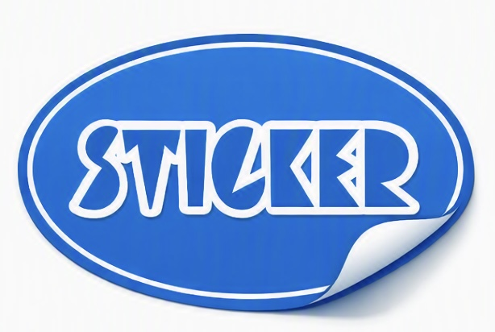

<h1></h1>sticker-board

写真をステッカー化して、シール帳みたいに思い出をかわいく記録できます
<link rel="icon" href="favicon.jpg" type="image/jpeg">

<h1>実行可能なタスク

・好きな写真を高画質でシール化

・シールを好きな場所に移動

・完全オフライン対応

<head>
<link rel="stylesheet" href="style.css">

<h1 id="title">Sticker Board</h1>

  ここにボードを作る

